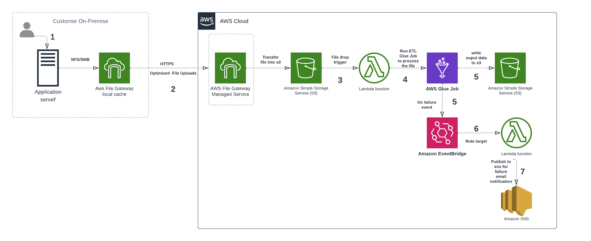
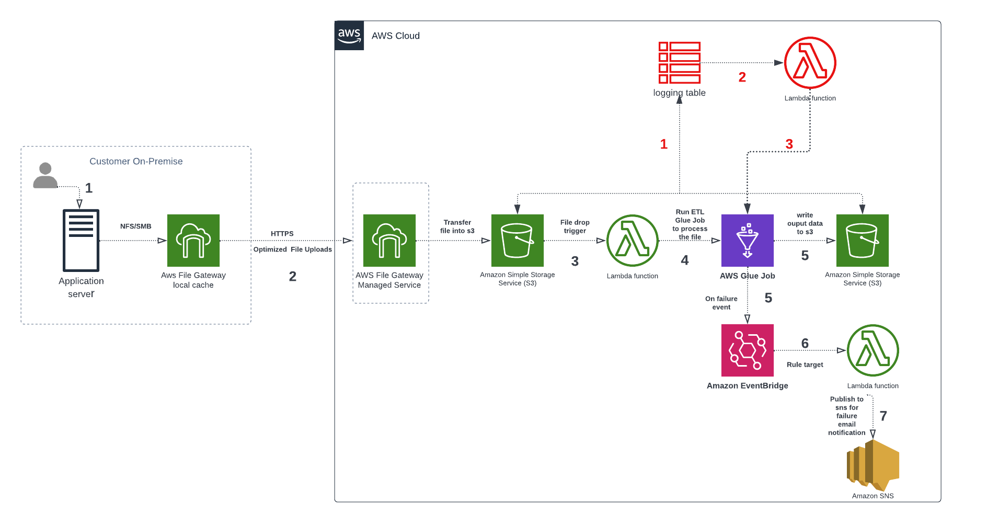

### 1. Goals

Implementing a python application with at least one class using AWS infrastructure to process the client's hit level data. 
The final output should be a tab delimited file with revenue generated per each search word per domain.

---

### 2. Design Considerations 
An event driven serverless ETL architecture is chosen to process the client files as it reduces complexity by decomposing the 
workflow with easier operational management and reduced operational cost. They are easily scalable, extensible and enable 
the ETL pipelines to respond in near-real time, delivering fresh data to business users. Also, a serverless architecture promotes 
workloads that are:

- <b>Reliable</b>: offering end users a high level of availability. AWS serverless services are reliable because they are also designed for failure.
- <b>Durable</b>: providing storage options that meet the durability needs of your workload.
- <b>Secure</b>: Aws roles are attached to application resources to secure access to workloads.
- <b>Performant</b>: using computing resources efficiently and meeting the performance needs of end users. Autoscaling capabilities can be enabled with a click to scale the application according to file size.
- <b>Cost-efficient</b>: designing architectures that avoid unnecessary cost that can scale without overspending, and also be decommissioned, if necessary, without significant overhead.

---

### 3. Event driven architecture of ETL application

#### Application workflow
1. Client's application writes the required file to client's on premise server s3 mount location (A mount point is an on premise directory to which NFS share is attached).
2. As soon as new file lands in on-premise server mount point location, aws file gateway transfers the file to configured s3 bucket.
3. As the file is created/available in s3 bucket, s3 sends an event to [Lambda function](./lambda_glue_job_trigger.py) with the file details. This acheived 
by adding a S3 PUT event trigger on lambda.
4. The above Lambda function starts a [Glue Job](./revenue_glue_job.py) to process the input file.
5. [Glue job](./revenue_glue_job.py) does the required processing to write the final output to S3 bucket. An EventBridge rule is executed if the glue job fails. 
6. Event bridge rule triggers a [Lambda function](./lambda_glue_failure_notification.py).
7. [Lambda function](./lambda_glue_failure_notification.py) publishes a failure message to sns topic. All subscribers of sns topic will get the glue job failure notification.

---

### 4. Deploying the solution with AWS Cloud Formation. 
By deploying the provided [AWS CloudFormation stack](./cf_app_infra.yml) all the required resources  can be created other than storage gateway and fileshare.
As ClouFormation does not directly support storage gateway and fileshare they are created and deployed manually following [aws documentation](https://docs.aws.amazon.com/storagegateway/latest/userguide/ec2-gateway-file.html).

Cloud Formation template generates the following resources:

- <b>IAM roles and policies</b> – We use the following AWS Identity and Access Management (IAM) roles:
  - adobeGlueServicerole: Role for glue job to access s3 buckets to read and write the data.
  - lambdaGlueTrigger: Role for lambda to trigger glue jobs and publishing messages to sns topics.
- <b>S3 bucket</b> – This is used to store data, job scripts, and output files generated during the AWS Glue ETL job run.
- <b>EC2 Instances</b> - Two ec2 instances: one for storage gateway medium and other to act as on premise server.
- <b>Security groups</b> - To allow the inbound and outbound traffic to ec2 instances.
- <b>Elastic IP</b> - To attach a fixed public ip to on premise EC2 instance.
- <b>Glue Job</b> - To process the input file to calculate the revenue per search term
- <b>Lambda function</b> – Two lambda functions: one to trigger the glue job and other to publish a failure message to sns in case of glue job failure
- <b>Event Bridge</b> - Rule to trigger a lambda function if the glue job fails.

---

### 5. Application Performance

AWS serverless services, including Lambda, are fault-tolerant and designed to handle failures. In the case of Lambda, 
if a service invokes a Lambda function and there is a service disruption, Lambda invokes the function in a different 
Availability Zone.

AWS Glue is serverless ETL service that can automatically scale up and scale down the workers based on the workload.
So based on client's file size no of workers for glue job can be configured accordingly to process it without OOM errors. 

As mentioned in the requirements that client can send up to 10 GB file, A maximum of 2 G1.X worker types can be used in 
glue configuration. Each worker maps to 1 DPU (4 vCPU, 16 GB of memory, 64 GB disk), and provides 1 executor per worker.

---

### 6. Conclusion

---

### 7. Future Considerations

Current application doesn't track the status of a given file run. So in case of any failure in custom code of 
glue job or lambda function the workflow is not retired. In this case the application can be extended to develop 
the pipeline for retries and failures using below extended architecture highlighted in red. 

1) A logging table in postgres/dynamo db can be used to track/log the status of the 
workflow for each file run at every stage. 
2) A separate process in lambda function can be run on a scheduled basis which reads the logging table to figure out all the failed runs based on
run status 
3) Lambda will have logic for re-triggering the glue jobs for all failed runs.
