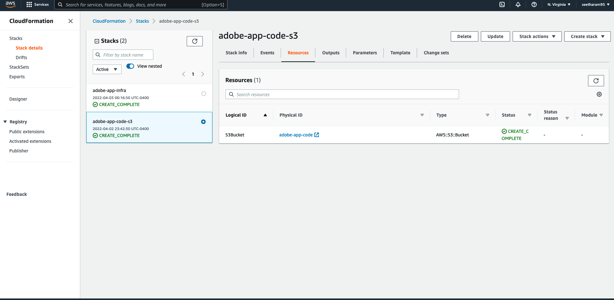
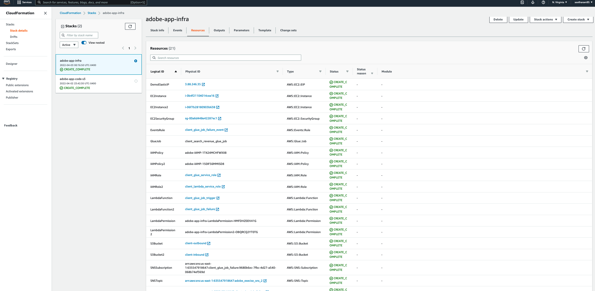
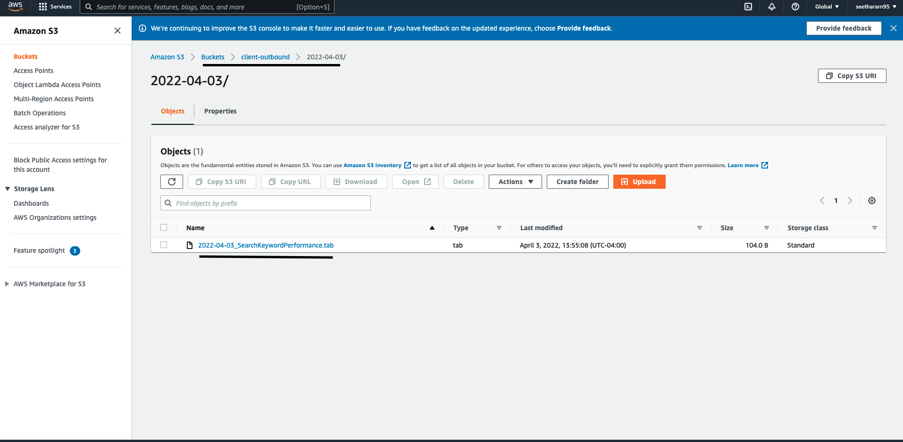
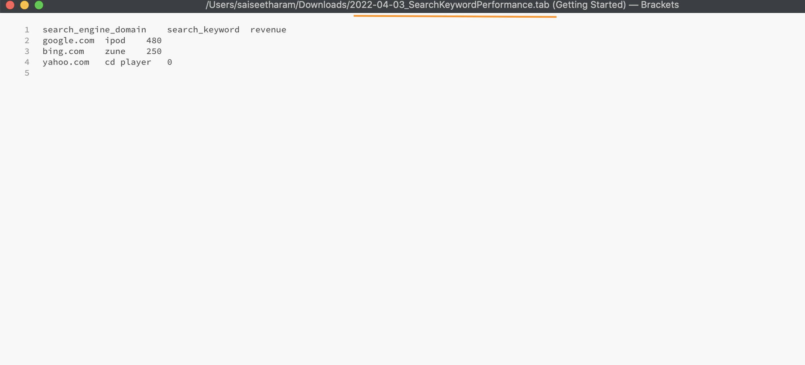

### 1. Goals

Implementing a python application with at least one class using AWS infrastructure to process the client's hit level data. 
The final output should be a tab delimited file with revenue generated per each search word per domain.

### 2. Design Considerations
An event driven serverless ETL architecture is chosen to process the client files as it reduces complexity by decomposing the 
workflow with easier operational management and reduced operational cost. They are easily scalable, extensible and enable 
the ETL pipelines to respond in near-real time, delivering fresh data to business users. Also, a serverless architecture promotes 
workloads that are:

- <b>Loosely coupled</b>: Event consumers only need to know the format of the event. They don't worry 
about who is sending the data. Similarly, event producers push the event to routers in required format and don't worry 
about consumer of the event.
- <b>Agile</b>: No custom code is required to poll the events; the event router will automatically push the events to consumers dynamically.
This removes heavy coordination between producer and consumer services, speeding up development process.
- <b>Scalable</b>: Since event producers, event routers and event consumers are decoupled, each can be scaled independently 
according to the workload
- <b>Cost-efficient</b>: Event-driven architectures are push-based, so everything happens on-demand when an event is generated.
This way, we are not paying for continuous polling to check for an event. This means less network bandwidth consumption, less resource consumption

### 3. Event driven architecture of ETL application

#### Application workflow
1. Client's application writes the required file to client's on premise server s3 mount location (A mount point is an on premise directory to which NFS share is attached).
2. As soon as new file lands in on-premise server mount point location, aws file gateway transfers the file to configured s3 bucket.
3. As the file is created/available in s3 bucket (event producer), s3 sends an event to [Lambda function](lambda_functions/lambda_glue_job_trigger.py) with the file details. This achieved 
by adding a S3 PUT event trigger on lambda.
4. The above Lambda function (event router) starts a [Glue Job](glue_jobs/search_revenue_glue_job.py) to process the input file.
5. [Glue job](glue_jobs/search_revenue_glue_job.py) (event consumer) does the required processing to write the final output to S3 bucket. An EventBridge rule is executed if the glue job fails. 
6. Event bridge rule triggers a [Lambda function](lambda_functions/lambda_glue_failure_notification.py).
7. [Lambda function](lambda_functions/lambda_glue_failure_notification.py) publishes a failure message to sns topic. All subscribers of sns topic will get the glue job failure notification.

In short:
- event producer: Inbound s3 bucket object put's.
- event router: lambda function.
- event consumer: glue job.

### 4. Deploying the solution with AWS Cloud Formation. 
Except for storage gateway and fileshare all the other required resources can be created by deploying the AWS CloudFormation stacks i.e. [stack_1](cf_templates/cf_app_infra_stack_1.yml) and [stack 2](cf_templates/cf_app_infra_stack_2.yml).
As CloudFormation does not directly support storage gateway and fileshare they are created and deployed manually following [aws documentation](https://docs.aws.amazon.com/storagegateway/latest/userguide/ec2-gateway-file.html).

[stack_1](cf_templates/cf_app_infra_stack_1.yml) is deployed initially to create a S3 bucket to store glue job code and then [stack_2](cf_templates/cf_app_infra_stack_2.yml) which
generates the following resources:

- <b>IAM roles and policies</b> – We use the following AWS Identity and Access Management (IAM) roles:
  - client_glue_service_role: Role for glue job to access s3 buckets to read and write the data.
  - client_lambda_service_role: Role for lambda to trigger glue jobs and publishing messages to sns topics.
- <b>S3 bucket</b> – This is used to store client input data transferred by storage gateway from client's server.
- <b>EC2 Instances</b> - Two ec2 instances: one for storage gateway medium and other to act as on premise server.
- <b>Security groups</b> - To allow the inbound and outbound traffic to ec2 instances.
- <b>Elastic IP</b> - To attach a fixed public ip to on premise EC2 instance.
- <b>Glue Job</b> - To process the input file to calculate the revenue per search term
- <b>Lambda function</b> – Two lambda functions: one to trigger the glue job and other to publish a failure message to sns in case of glue job failure
- <b>Event Bridge</b> - Rule to trigger a lambda function if the glue job fails.

##### Execution output of cloud formation stacks:

[stack_1](cf_templates/cf_app_infra_stack_1.yml) 

[stack_2](cf_templates/cf_app_infra_stack_2.yml) 

### 5. Application Output
As shown in below images, final output of glue job is a tab delimited file written to an outbound s3 bucket folder. The folder name is in yyyy-mm-dd format 
and file name is in "[yyyy-mm-dd]_SearchKeywordPerformance.tab" format ("yyyy-mm-dd" represents application execution date).

 
 

### 6. Monitoring and Logging
CloudWatch Metrics and logs are used to  monitor and capture the runtime metrics and log statements of the application. 
CloudWatch Metrics brings observability into the application by providing details on performance of the system
Also, for every run a log stream is automatically generated and all the run details are present in the log stream.

### 7. Application Performance

AWS serverless services, including Lambda, are fault-tolerant and designed to handle failures. In the case of Lambda, 
if a service invokes a Lambda function and there is a service disruption, Lambda invokes the function in a different 
Availability Zone.

AWS Glue is serverless ETL service that can automatically scale up and scale down the workers based on the workload.
So based on client's file size no of workers for glue job can be configured accordingly to process it without OOM errors. 

As mentioned in the requirements that client can send up to 10 GB file, A maximum of 2 G1.X worker types can be used in 
glue configuration. Each worker maps to 1 DPU (4 vCPU, 16 GB of memory, 64 GB disk), and provides 1 executor per worker.

### 8. Conclusion

event-driven architecture is used to provide access to near-real-time information on revenue
generated per each search term. This will help business to make faster decisions on fresh data.
Not only that application checks many boxes related to lower cost, scalability and faster 
delivery (application is built within matter of days).

### 9. Future Enhancements
1) Manual deployments of cloud formation templates can be automated using a build system like jenkins/GitHub 
actions there by promoting Continuous Delivery of pipeline.
2) Current application doesn't track the status of a given file run. So in case of any failure in custom code of 
glue job or lambda function, the workflow is not retired. In this case the application can be extended to develop 
the pipeline for retries and failures using below extended architecture highlighted in red. 

   1) A logging table in postgres/dynamo db can be used to track/log the status of the 
   workflow for each file run at every stage. 
   2) A separate process in lambda function can be run on a scheduled basis which reads the logging table to figure out all the failed runs based on
   run status 
   3) Lambda will have logic for re-triggering the glue jobs for all failed runs.

